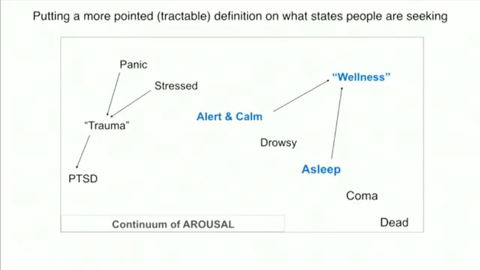

> Intensity has to come with ease, not with tension.

Intense is not tense and relaxity is not laxity.

Being intense and relaxed makes us more perceptive

Inablity to be at ease is disease.

Stable energitic body or pranamaya kosha will lead to ease

It is time you work upon bringing yourself to ease – not only with other people, just with life. The life that you are must be at ease. If you are not at ease, you will never realize your full potential.

In agitation, everything is distorted. So, being at ease is most important, otherwise you will not experience life the way it is. ~ Sadhguru

## Remember to play.

Playfulness, says Sadhguru, has been wrongly equated with irresponsibility. Instead of walking around with a long face, entangled with your own creation, if you are playful with life and in tune with the larger creation, it is the most responsible way to live. If you want to walk the path of devotion, you cannot save yourself – you must burn with passion.

Being playfull is not irresponsibility. Only when you are playfull you are responsive. When you are serious it is all about you.

Meditation is a natural process for one who is playfull. it does not accumulate karma.

Everyone is seeking pleasentness and profoundness in life

If you want to be at ease you must have

- A vibrant body
- An open mind
- A Loving heart
- Intensity of energy in the system

Practice:

Everytime observer yourself for tensions in the body. Bring everything under consiciouness to ease.

References:

https://youtu.be/diFkCJ802vY