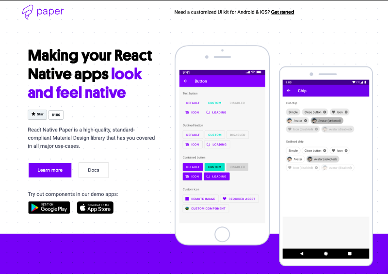
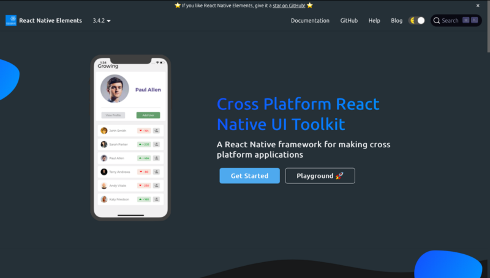
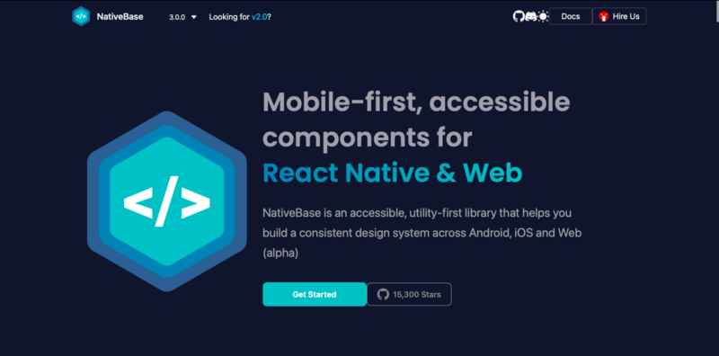
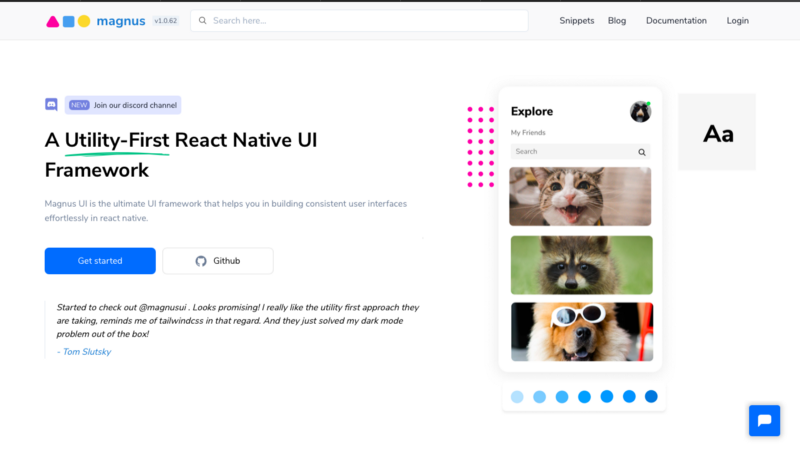
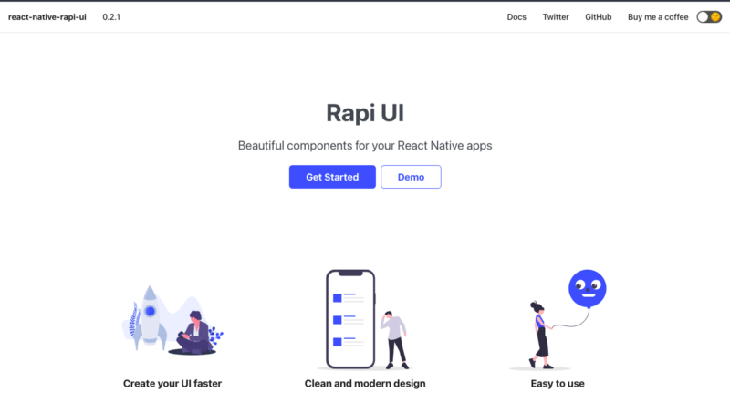

There are many component libraries are there for react native in the market. Here top cross platform component libraries are listed not in particular order.

### [React Native Paper](https://callstack.github.io/react-native-paper/index.html) — Cross-platform Material Design for React Native.

⭐️ : 8.2k

Paper is a collection of customisable and production-ready components for React Native, following Google’s Material Design guidelines.

Pros:

- Material design components with responsive animations and transitions
- Full [theming support](https://blog.logrocket.com/designing-a-ui-with-custom-theming-using-react-native-paper/)
- Easy to integrate with [react navigation theme](https://reactnavigation.org/blog/2020/01/29/using-react-navigation-5-with-react-native-paper/).
- Accessibility and RTL support
- Well maintained.
- It contains about 30 customizable and production-ready components

Cons:

- Does not handle responsiveness across devices of different screen sizes
- Does not support utility props

**Demo**: Try the demo on [Snack](https://snack.expo.io/@react-native-paper/github.com-callstack-react-native-paper:example), [iOS](https://apps.apple.com/app/react-native-paper/id1548934513) or [Android](https://play.google.com/store/apps/details?id=com.callstack.reactnativepaperexample&hl=pl&gl=US).

**Docs**: [https://callstack.github.io/react-native-paper/getting-started.html](https://callstack.github.io/react-native-paper/getting-started.html)

### React Native Elements — Cross-Platform UI Toolkit

⭐️ : 20k

React Native Elements is another extensive cross-platform UI toolkit with many contributed components. The library includes components such as avatar, pricing, badge, overlay, divider, social icon buttons, and more. There is also a demo app on Expo, developed using all of the React Native Elements components. Incredibly, all these can also be used in React Native Web apps.

Pros:

- Easy to use
- Customisable of components
- Lot of components such as pricing, badge, overlay, and platform-specific search bars
- Community-Driven project

Cons:

- Dynamic theming is hard.
- Does not support utility props

**Docs**: [https://reactnativeelements.com/](https://reactnativeelements.com/)

**Demo**: [Run on expo go](https://expo.io/@flyingcircle/react-native-elements-app)

### NativeBase — Cross-platform React Native Component Library

⭐️ : 12k

NativeBase is an accessible, utility-first library that helps you build a consistent design system across Android, iOS and Web (alpha)

Pros:

- Highly themeable components
- Out of the Box Accessibility
- Responsive across devices
- Supports utility props
- NativeBase offers nearly 40 components so you can build seamlessly. It includes action sheets, menus, spinners, popovers, breadcrumbs and more.

Cons:

- Web support is still in alpha

**Docs**: [https://nativebase.io/](https://nativebase.io/)

**Demo**: [https://kitchensink.nativebase.io/](https://kitchensink.nativebase.io/)

### React Native UI Kitten

⭐️ : 8k

UI Kitten is a React Native implementation of the Eva Design System. The framework contains a set of general-purpose UI components styled in a similar way. The most awesome thing about Ui Kitten is that the themes can be changed in the runtime without reloading the application. This way, you may easily focus on business logic, while UI Kitten takes care of the visual appearance of your product.

Pros:

- Easy theming support
- Includes eva icons
- 20 general purpose components
- Uses [eva design system](https://eva.design)

Cons:

- Web support is experimental
- Requires react native svg library for icons
- Does not include react native vector icons by default

**Docs**: [https://akveo.github.io/react-native-ui-kitten/](https://akveo.github.io/react-native-ui-kitten/)

**Demo**: [https://akveo.github.io/react-native-ui-kitten/#kitten-tricks](https://akveo.github.io/react-native-ui-kitten/#kitten-tricks)

### Magus UI — A Utility-First React Native UI Framework

⭐️ : 763

Magnus UI is a design system for react-native based on the atomic design principle. It helps developers and designers to build consistent components quickly in terms of UI and UX. Like Chakra UI for react.

Pros:

- A Utility-First approach
- 25+ well polished react native components
- Easy customization of default theme.
- Based on Atomic Design Methodology.

Cons:

- Relatively new library

**Docs**: [https://magnus-ui.com/](https://magnus-ui.com/)

**Demo**: [https://magnus-ui.com/docs/examples/](https://magnus-ui.com/docs/examples/)

#### Other Libraries

**Rapi UI**

Link to the site: [https://rapi-ui.kikiding.space/](https://rapi-ui.kikiding.space/)
