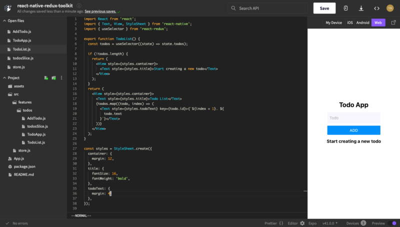
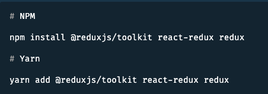
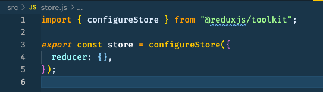
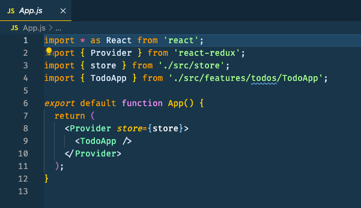
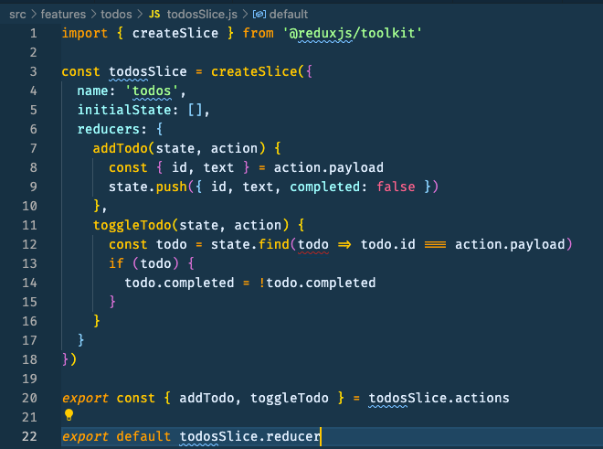
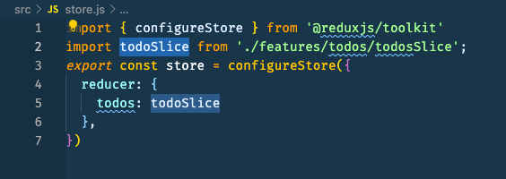
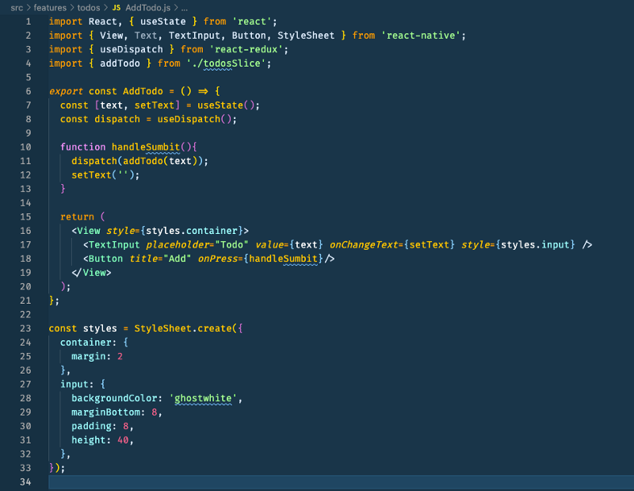
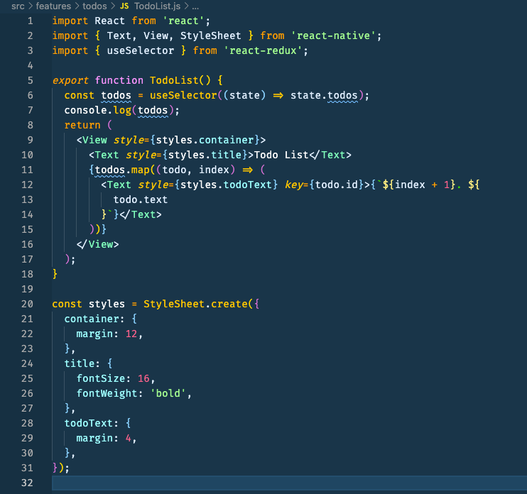

In this article, we will build a simple todo app using the Redux toolkit in React Native.

**_Link expo snack:_** [_https://snack.expo.io/@yajana/react-native-redux-toolkit_](https://snack.expo.io/@yajana/react-native-redux-toolkit)

**_Link to GitHub repository:_** [_https://github.com/YajanaRao/react-native-redux-toolkit-app_](https://github.com/YajanaRao/react-native-redux-toolkit-app)

Let’s start by installing the required libraries for building a todo app.

### Install required dependencies

Install redux-toolkit using npm or yarn

### Creating a Redux Store

Let’s start by creating a file named `src/store.js`. Import the `configureStore` API from Redux Toolkit. We’ll start by creating an empty Redux store, and exporting it:

### Provide the Redux Store to React Native

We will make the redux available to React Native components by wrapping React-Redux `<Provider/>` around our application in `App.js`. Import the Redux store we just created, put a `<Provider/>` around your `<App/>`, and pass the store as a prop:

### **Creating the Todos Slice**

Add a new file named `src/features/todos/todosSlice.js`. In that file, import the `createSlice` API from Redux Toolkit.

### **Add Slice Reducers to the Store**

Next, we need to import the todos reducer function from the todos slice and add it to our store. By defining a field inside the reducers parameter, we tell the store to use this slice reducer function to handle all updates to that state.

### Using Redux State and Actions in React Native Components

Now let’s create `AddTodo` and `TodoList` components to use redux state and actions.

In AddTodo component, we use `useDispatch` to use Redux actions in React Native components. On pressing add button addTodo action will be dispatched with todo text as payload.

In TodoList we use `useSelector` hook to access the todos in the redux store.

Now let’s import `<AddTodo/>` and `<TodoList/>` component in App component to see a working Todo App.

**_Link expo snack_**_:_ [_https://snack.expo.io/@yajana/react-native-redux-toolkit_](https://snack.expo.io/@yajana/react-native-redux-toolkit)

**_Link to the GitHub repository_**_:_ [_https://github.com/YajanaRao/react-native-redux-toolkit-app_](https://github.com/YajanaRao/react-native-redux-toolkit-app)

#### References:

[Redux Toolkit](https://redux-toolkit.js.org/tutorials/quick-start)

[reduxjs/redux-toolkit](https://github.com/reduxjs/redux-toolkit/blob/e85eb17b39a2118d859f7b7746e0f3fee523e089/docs/tutorials/intermediate-tutorial.md)
