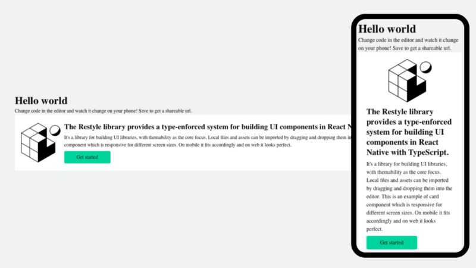

In this blog I will show you how to build a responsive react native components using Restyle.



The Restyle library provides a type-enforced system for building UI components in React Native with TypeScript. It’s a library for building UI libraries, with themability as the core focus.

#### Installation

Yarn

```shell
$ yarn add @shopify/restyle
```

NPM

```shell
$ npm install @shopify/restyle
```

#### Define Theme

Let’s create a global theme object. It should contain values for spacing, colors, breakpoints and more.

Below is an example of how a basic theme could look.

#### Access theme

This theme should be passed to a `ThemeProvider` at the top of your React component tree:

Here `Box` and `Text` are [_predefined components_](http://Breakpoints%20are%20defined%20as%20minimum%20widths%20%28inclusive%29%20for%20different%20target%20screen%20sizes%20where%20we%20want%20to%20apply%20differing%20styles.%20Consider%20giving%20your%20breakpoints%20names%20that%20give%20a%20general%20idea%20of%20the%20type%20of%20device%20the%20user%20is%20using.%20Breakpoints%20can%20be%20defined%20by%20either%20a%20single%20value%20%28width%29%20or%20an%20object%20containing%20both%20width%20and%20height:) from `restyle`

#### Creating responsive components

Using [_breakpoints_](http://Breakpoints%20are%20defined%20as%20minimum%20widths%20%28inclusive%29%20for%20different%20target%20screen%20sizes%20where%20we%20want%20to%20apply%20differing%20styles.%20Consider%20giving%20your%20breakpoints%20names%20that%20give%20a%20general%20idea%20of%20the%20type%20of%20device%20the%20user%20is%20using.%20Breakpoints%20can%20be%20defined%20by%20either%20a%20single%20value%20%28width%29%20or%20an%20object%20containing%20both%20width%20and%20height:) we can specify different styles for different screen sizes.

Let’s create a card example with acts as list on wide screen devices.

Define the different values of flex direction for different screen sizes.

```js
flexDirection={{ phone: ‘column’, tablet: ‘row’ }}
```

For more details visit [_restyle documentation_](https://github.com/Shopify/restyle#breakpoints)

#### Reference:

- [Demo Snack](https://snack.expo.dev/@yajana/restyle)
- [ReStyle](https://snack.expo.dev/@yajana/restyle)
